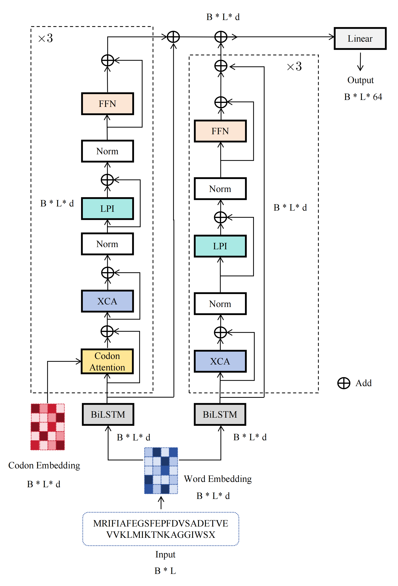

# CodonAttGen
## Overview
Repository for the application of CodonAttGen. Messenger RNA-based vaccines have been widely used for viral prevention due to good safety and scalable production. Precise modeling and generation of human CDS sequences helps reveal the intrinsic codon usage rules of human transcripts. Traditional sequence modeling methods rely on empirical statistical features or fail to capture long-range sequence dependencies and fine-grained codon-level interactions. This work develops a deep learning framework for native human CDS sequence generation.



## Functions
```bash
test.py_ codes for predict.  
model/attention.py_ codes for attention.  
model/wordsequence.py_ codes for CodonAttGen model.  
utils/data.py_ codes for input embedding vectors and 64-possible codons as embedding vectors.  
utils/metric.py_ codes for evaluation metric.
```

## Model_weights
[model weights](https://pan.baidu.com/s/1t4pKT-D83VQ6sDRKp0K9YQ pwd=6666)

## System_Requirements
### 1.Hardware requorements
Only a standard computer with enough RAM to support the in-memory operations is required.  

### 2.Software requirements
#### OS requirements
#### The codes are tested on the following Oses:
(1)	Linux x64  
(2)	Windows 10 x64  
#### And the following x86_64 version of Python:
Python 3.X  
#### Python dependencies:
(1)	torch  
(2)	Bio   
(3)	torchvision 

## Installation_Guide
### Download the codes
```bash
git clone https://github.com/Audrey1999/CodonAttGen.git
```
### Prepare the environment
We recommend you to use Anaconda to prepare the environments.
```bash
conda create -n CodonAttGen python=3.10  
conda activate CodonAttGen  
pip install torch==2.4.0 torchvision==0.19.0 torchaudio==2.4.0 --index-url https://download.pytorch.org/whl/cu121    
pip install Bio
```

## Usage and Demo
### Example of Running Command
```bash
python test.py --status dev --batch_size 8 --hidden_dim 3000 --word_emb_dim 3000 --N_layer 3 --dset_dir w3000_1128.dset --load_model_dir  w3000_1128.model
```

## Thanks
We build our model based on the architecture [code](https://github.com/jiesutd/NCRFpp)

## Contact Us
If you have questions about using CodonAttGen, please contact us.

